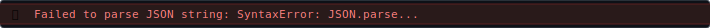
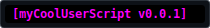
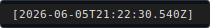

# pretty-debug 🎨
A tiny, cross-platform JavaScript debug console featuring custom color styles and automatic runtime environment tracking.

## Features
* 👤 **Automatic Environment Detection:** Intelligently identifies if it is running inside Tampermonkey, Violentmonkey, Greasemonkey, Node.js, or directly in a Browser Console.
* 🌈 **CSS Colored Output:** Leverages console substitution tokens (`%c`) to provide rich, visual logging tiers without cluttering your core logic lines.
* 🛡️ **Sandbox Safe:** Free of global object pollutions—ideal for isolated userscript execution blocks or browser extension frames.
* ⚙️ **Highly Configurable:** Easily toggle metadata tags, live system timestamps, or route messages to custom developer streams.

## Installation & Setup
### 1. Userscript Managers ([Greasemonkey](https://greasemonkey.en.softonic.com)|[Tampermonkey](https://www.tampermonkey.net)|[Violentmonkey](https://violentmonkey.github.io/))
 - Simply add the raw branch link to your userscript metadata header block:
```javascript
// @require      https://raw.githubusercontent.com/Technical-13/pretty-debug/refs/heads/main/debug.js
```
 - Initialization Configuration
Instantiate the debug instance at the top of your execution wrapper. You can configure custom settings or leave it empty to rely on our automatic environment discovery rules:
```javascript
const debug = new Debug( {
  name: 'myCoolUserscript',
  version: '0.0.1',         // Optional: defaults to auto-detected script or env version
  logChan: 'debug',         // Optional: choose 'debug', 'info', 'log', etc. Defaults to 'debug' with 'info' fallback.
  showTag: true,            // Optional: toggle switch for [myCoolUserScript v0.0.1] tag. Defaults to true.
  showTime: true,           // Optional: toggle the live system timestamp bracket. Defaults to true.
  styles: {                 // Optional: override any default color palette styles
    halloween: 'color: #00FFFF; background: #000000; font-weight: bold;'
  }
} );
```

### 2. [Node.js](https://nodejs.org) Context
 - Because the library wraps its execution inside an environmental sandbox, simply requiring the file injects the `Debug` constructor directly into your global Node execution scope.

```javascript
require( './path/to/debug.js' );
const debug = new Debug( { name: 'myCoolBot', version: '0.0.1' } );
debug.success(
  '%cpretty-debug%c successfully initialized in Node.js context!',
  debug.style.rainbow,
  debug.style.reset
);
```

### 3. Browser Console Context
To run diagnostics or test features directly inside your browser developer tools (`F12`), paste this snippet into your Console tab to dynamically inject and instantiate the library instantly:

```javascript
fetch( 'https://raw.githubusercontent.com/Technical-13/pretty-debug/refs/heads/main/debug.js' )
  .then( res => res.text() )
  .then( code => {
    eval( code );
    window.debug = new Debug( { name: 'devTools', logChan: 'log' } );
    debug.success(
      '%cpretty-debug%c successfully injected globally into this tab!',
      debug.style.rainbow,
      debug.style.reset
    );
  } );
```

## Usage API
 - Once initialized, call your specific logging levels directly from your application logic. Every method supports [console string substitution](https://developer.mozilla.org/en-US/docs/Web/API/console#using_string_substitutions) tokens and infinite trailing arguments:
 - If you need to style a specific string slice mid-sentence, pass public `debug.style` properties into your arguments array. Use `debug.style.reset` to smoothly restore your text colors right back to the method's native brand theme!

### Advanced Styling: `debug.style`
The public `debug.style` property exposes your active theme dictionary as a read-only object. To style specific pieces of text *inside* a log sentence, insert multiple `%c` substitution markers into your message string, and pass your chosen styles sequentially inside the trailing variables array:

```javascript
debug.info( 'Task status: %cRUNNING%c. Stand by for server sync...', debug.style.warn, debug.style.reset);
```

#### Available Default Theme Styles

* ⚙️ `debug.style.debug` — **Standard Console Channel** 
  * *Appearance:* Flat, muted medium-gray text designed for low-priority diagnostics.
* ❌ `debug.style.error` — **Standard Error Line**
  * *Appearance:* Thick, high-visibility crimson red font face.
* 🚨 `debug.style.fatal` — **Critical System Panic** 
  * *Appearance:* Thick pale yellow font face isolated over a solid blood-red background bar.
* 🔷 `debug.style.info` — **Informational Messages** 
  * *Appearance:* Vibrant, professional high-contrast deep corporate blue text.
* ✉️ `debug.style.log` — **Raw Baseline Text** 
  * *Appearance:* Completely clean, unstyled font properties that inherit browser environments natively.
* 🌐 `debug.style.network` — **Interceptor Telemetry** 
  * *Appearance:* Slanted, italicized electric cyan font face.
* 🌈 `debug.style.rainbow` — **1990's Throwback Spectrum** 
  * *Appearance:* High-contrast black font face set on a solid horizontal linear color wave.
* 🚯 `debug.style.reset` — **Dynamic Brand Restore Token**
  * *Appearance:* Evaluates dynamically on the fly to match your wrapper's primary theme.
  * *Usage:* Restores mid-sentence strings safely back to your level colors instead of stripping them down to browser defaults.
* ✅ `debug.style.success` — **Confirmation Milestones** 
  * *Appearance:* Bright, crisp neon emerald green text.
* 🏷️ `debug.style.tag` — **`[myAppName v#.#.#]` Banner** 
  * *Appearance:* Bold magenta text resting over a flat pitch-black background plate.
* ⏱️ `debug.style.time` — **Timestamp Tag** 
  * *Appearance:* Bold dark-red text resting over a standard slate charcoal background plate.
* ⚠️ `debug.style.warn` — **Standard System Warning** 
  * *Appearance:* Thick, high-contrast goldenrod yellow font face.

### `debug.console( message, ...args )`
 - Routes logs into your standard target channel stream (defaulting to low-priority diagnostic streams).
```javascript
debug.console( 'Loop processing speed: %s ms', duration, metricObj );
```

### `debug.error( message, ...args )`
 - Routes high-priority tracking events to describe standard operational failures and data exceptions.
```javascript
debug.error( 'IndexedDB transaction locked. Event details: %o', errorEvent );
```

### `debug.fatal( message, ...args )`
 - Routes high-impact, unrecoverable execution panics and core system shutdowns.
```javascript
debug.fatal( 'Critical engine shutdown. Core exception stack: %o', errorObject );
```

### [`debug.group( label )`](https://developer.mozilla.org/en-US/docs/Web/API/console#using_groups_in_the_console)
 - Initiates an expandable nested logging indentation layer block.
```javascript
debug.group( 'Leaderboard Update Cycle' );
```

### [`debug.groupCollapsed( label )`](https://developer.mozilla.org/en-US/docs/Web/API/console#using_groups_in_the_console)
 - Initiates a collapsed nested logging indentation layer block.
```javascript
debug.groupCollapsed( 'Detailed Payload Metrics' );
```

### [`debug.groupEnd()`](https://developer.mozilla.org/en-US/docs/Web/API/console#using_groups_in_the_console)
 - Terminates the current active nested indentation layer block.
```javascript
debug.groupEnd();
```

### `debug.info( message, ...args )`
 - Transmits standard status data updates and transaction tracking announcements.
```javascript
debug.info( 'Refreshing connection properties for user: %s', userName );
```

### `debug.log( message, ...args )`
 - Passes a clean, unstyled tracking string packet directly through console text pipelines.
```javascript
debug.log( 'Plain text data sequence buffer dump:', rawArrayPayload );
```

### `debug.network( message, ...args )`
 - Dedicated style for tracking request payloads, API endpoints, HTTP traffic, and interceptor status.
```javascript
debug.network( 'Intercepted fetch response from path: %s', urlString, responseHeaders );
```

### `debug.success( message, ...args )`
 - Generates a highlighted positive processing confirmation or milestone completion marker.
```javascript
debug.success( 'Local database established. Total records synced: %d', totalCount );
```

### [`debug.time( label )`](https://developer.mozilla.org/en-US/docs/Web/API/console#timers)
 - Starts a high-accuracy system stopwatch timer tracking a unique reference key token.
```javascript
debug.time( 'leaderboardProcessing' );
```

### [`debug.timeEnd( label )`](https://developer.mozilla.org/en-US/docs/Web/API/console#timers)
 - Concludes a stopwatch timer loop tracking run and outputs elapsed delta milliseconds.
```javascript
debug.timeEnd( 'leaderboardProcessing' );
```

### [`debug.timeLog( label, ...args )`](https://developer.mozilla.org/en-US/docs/Web/API/console#timers)
 - Prints the current split value of an active running timer without stopping it.
```javascript
debug.timeLog( 'leaderboardProcessing', 'Completed page 1 parsing check' );
```

### [`debug.trace( ...args )`](https://developer.mozilla.org/en-US/docs/Web/API/console#stack_traces)
 - Outputs a complete interactive stack trace detailing the function execution chain history.
```javascript
debug.trace( 'Diagnostic checkpoint trace tracking location:' );
```

### `debug.warn( message, ...args )`
 - Signals system boundary alerts, asset bypass warnings, and soft timeouts without halting execution.
```javascript
debug.warn( 'Asset file loaded with alternative placeholder fallback parameters.' );
```

## License
Distributed under the BSD 3-Clause License. See [`LICENSE`](LICENSE) for more information.
